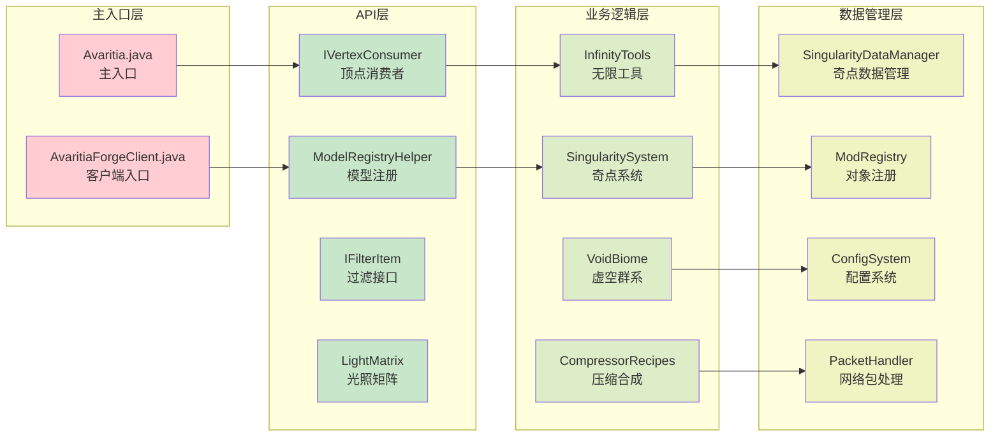
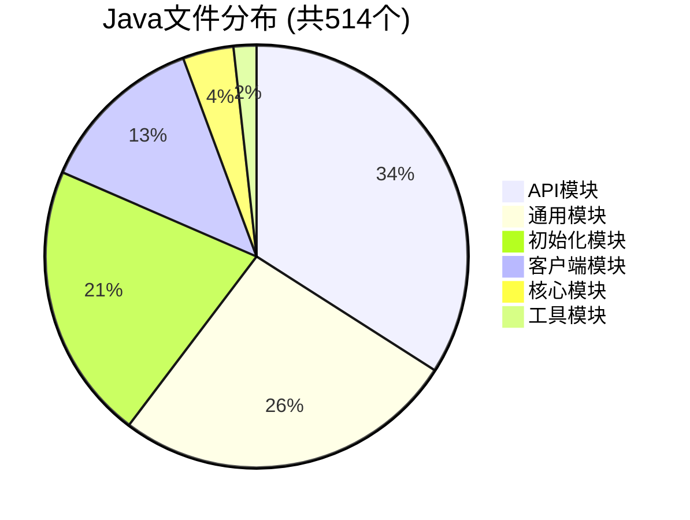
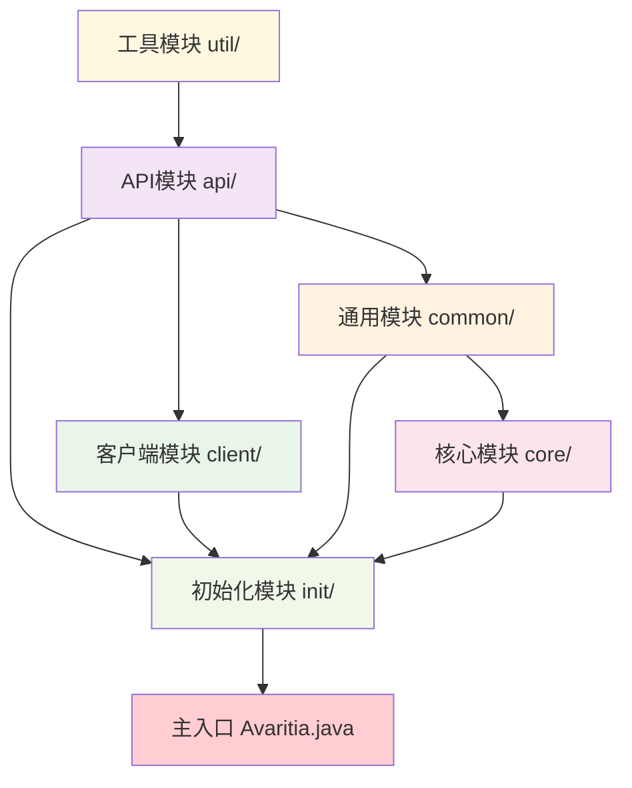
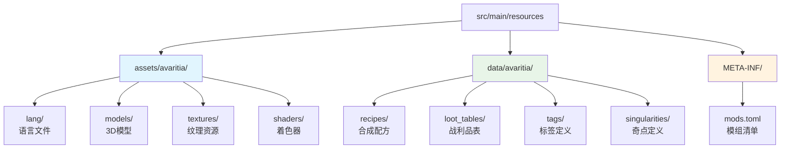
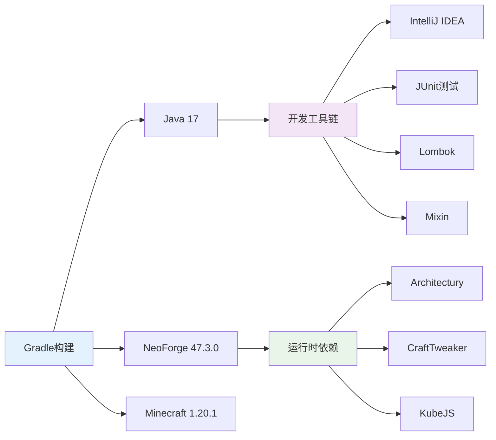

# 项目结构图 - Mermaid可视化

## 项目整体架构图

```mermaid
graph TB
    A[Re-Avaritia 项目根] --> B[API模块<br/>175文件]
    A --> C[客户端模块<br/>66文件]
    A --> D[通用模块<br/>135文件]
    A --> E[核心模块<br/>20文件]
    A --> F[初始化模块<br/>109文件]
    A --> G[工具模块<br/>9文件]

    B --> B1[client/<br/>客户端API]
    B --> B2[common/<br/>通用API]
    B --> B3[iface/<br/>接口定义]
    B --> B4[init/<br/>初始化API]
    B --> B5[util/<br/>工具API]

    C --> C1[hud/<br/>界面元素]
    C --> C2[model/<br/>模型处理]
    C --> C3[particle/<br/>粒子效果]
    C --> C4[render/<br/>渲染引擎]
    C --> C5[screen/<br/>GUI界面]
    C --> C6[shader/<br/>着色器]

    D --> D1[block/<br/>方块系统]
    D --> D2[item/<br/>物品系统]
    D --> D3[entity/<br/>生物系统]
    D --> D4[tile/<br/>方块实体]
    D --> D5[container/<br/>容器]
    D --> D6[crafting/<br/>合成系统]
    D --> D7[net/<br/>网络通信]

    E --> E1[singularity/<br/>奇点管理]
    E --> E2[chest/<br/>无限箱子]
    E --> E3[channel/<br/>通信管道]

    F --> F1[registry/<br/>对象注册]
    F --> F2[config/<br/>配置管理]
    F --> F3[data/<br/>数据生成]
    F --> F4[handler/<br/>事件处理]
    F --> F5[mixins/<br/>字节码注入]

    style A fill:#e1f5fe
    style B fill:#f3e5f5
    style C fill:#e8f5e8
    style D fill:#fff3e0
    style E fill:#fce4ec
    style F fill:#f1f8e9
    style G fill:#fff8e1
```

## 代码组织架构

```mermaid
graph LR
    subgraph "主入口层"
        A1[Avaritia.java<br/>主入口]
        A2[AvaritiaForgeClient.java<br/>客户端入口]
    end

    subgraph "API层"
        B1[IVertexConsumer<br/>顶点消费者]
        B2[ModelRegistryHelper<br/>模型注册]
        B3[IFilterItem<br/>过滤接口]
        B4[LightMatrix<br/>光照矩阵]
    end

    subgraph "业务逻辑层"
        C1[InfinityTools<br/>无限工具]
        C2[SingularitySystem<br/>奇点系统]
        C3[VoidBiome<br/>虚空群系]
        C4[CompressorRecipes<br/>压缩合成]
    end

    subgraph "数据管理层"
        D1[SingularityDataManager<br/>奇点数据管理]
        D2[ModRegistry<br/>对象注册]
        D3[ConfigSystem<br/>配置系统]
        D4[PacketHandler<br/>网络包处理]
    end

    A1 --> B1
    A2 --> B2
    B1 --> C1
    B2 --> C2
    C1 --> D1
    C2 --> D2
    C3 --> D3
    C4 --> D4

    style A1 fill:#ffcdd2
    style A2 fill:#ffcdd2
    style B1 fill:#c8e6c9
    style B2 fill:#c8e6c9
    style B3 fill:#c8e6c9
    style B4 fill:#c8e6c9
    style C1 fill:#dcedc8
    style C2 fill:#dcedc8
    style C3 fill:#dcedc8
    style C4 fill:#dcedc8
    style D1 fill:#f0f4c3
    style D2 fill:#f0f4c3
    style D3 fill:#f0f4c3
    style D4 fill:#f0f4c3
```

## 文件分布统计

```mermaid
pie title Java文件分布 (共514个)
    "API模块" : 175
    "通用模块" : 135
    "初始化模块" : 109
    "客户端模块" : 66
    "核心模块" : 20
    "工具模块" : 9
```

## 模块依赖关系图

```mermaid
graph TD
    A[工具模块 util/] --> B[API模块 api/]
    B --> C[客户端模块 client/]
    B --> D[通用模块 common/]
    D --> E[核心模块 core/]
    B --> F[初始化模块 init/]
    C --> F
    D --> F
    E --> F
    F --> G[主入口 Avaritia.java]

    style A fill:#fff8e1
    style B fill:#f3e5f5
    style C fill:#e8f5e8
    style D fill:#fff3e0
    style E fill:#fce4ec
    style F fill:#f1f8e9
    style G fill:#ffcdd2
```

## 资源文件结构

```mermaid
graph TB
    A[src/main/resources] --> B[assets/avaritia/]
    A --> C[data/avaritia/]
    A --> D[META-INF/]

    B --> E[lang/<br/>语言文件]
    B --> F[models/<br/>3D模型]
    B --> G[textures/<br/>纹理资源]
    B --> H[shaders/<br/>着色器]

    C --> I[recipes/<br/>合成配方]
    C --> J[loot_tables/<br/>战利品表]
    C --> K[tags/<br/>标签定义]
    C --> L[singularities/<br/>奇点定义]

    D --> M[mods.toml<br/>模组清单]

    style B fill:#e1f5fe
    style C fill:#e8f5e8
    style D fill:#fff3e0
```

## 构建和开发工具架构

```mermaid
graph LR
    A[Gradle构建] --> B[Java 17]
    A --> C[NeoForge 47.3.0]
    A --> D[Minecraft 1.20.1]

    B --> E[开发工具链]
    E --> F[IntelliJ IDEA]
    E --> G[JUnit测试]
    E --> H[Lombok]
    E --> I[Mixin]

    C --> J[运行时依赖]
    J --> K[Architectury]
    J --> L[CraftTweaker]
    J --> M[KubeJS]

    style A fill:#e3f2fd
    style E fill:#f3e5f5
    style J fill:#e8f5e8
```

---

*此结构图由AI自动生成，展示了Re-Avaritia项目的完整架构和组织结构*