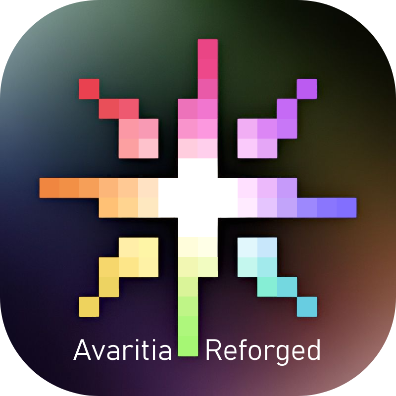

<p align="center">
      
</p>
<hr>
<p align="center">Avaritia Reforged is a Minecraft mod made for Minecraft Forge</p>
<p align="center">
    <a href="https://www.curseforge.com/minecraft/mc-mods/re-avaritia">
        
    </a>
    <a href="https://www.curseforge.com/minecraft/mc-mods/re-avaritia">
        
    </a>
    
</p>

<p align="center">
    <a href="README.md">English</a> | 
    <a href="README_CN.md">简体中文</a>
</p>


## **📕Introduction:**
* <span style="color: #ff0000;">This mod adds all from Avaritia.</span>
* This mod is <span style="color: #ff6600;">unofficial</span>!

## **✏️Authors:**

- Programmer: `cnlimiter` `Asek3` `MikhailTapio`

## **🔒License:**

- Code: [MIT](https://www.mit.edu/~amini/LICENSE.md)
- Assets: [CC BY-NC-SA 4.0](https://creativecommons.org/licenses/by-nc-sa/4.0/)

## **📌Download official:**
* [Avaritia (1.1x)](https://www.curseforge.com/minecraft/mc-mods/avaritia-1-10)
* [Avaritia (official)](https://www.curseforge.com/minecraft/mc-mods/avaritia)
* [AvaritiaLite](https://www.curseforge.com/minecraft/mc-mods/avaritia-lite)

## **❗Attention:**
* You&nbsp;<span style="color: #00ff00;"> **DEFINITELY CAN** </span>&nbsp;add the mod to your modpack.
* Recipe viewing is supported via JEI.
* You can add&nbsp;singularity by using json!
* You can add recipes by CraftTweaker!
* You can add recipes by KubeJs!


## **🔎Develop:**
### **CraftTweaker:**
```
mods.avaritia.Compressor.addRecipe("name", input, output, inputCount, timeCost);
mods.avaritia.Compressor.remove(output);
mods.avaritia.CraftingTable.addShaped("name", tier, output, ingredients);
mods.avaritia.CraftingTable.addShapeless("name", tier, output, ingredients);
mods.avaritia.CraftingTable.remove(output);
```

### **KubeJs:**
```javascript
ServerEvents.recipes(
    event => {
        const { avaritia } = event.recipes;
        avaritia.shaped_table(
            // shapeless is avaritia.shapeless_table
            4,
            "avaritia:infinity_sword",
            [
                "       I ",
                "      III",
                "     III ",
                "    III  ",
                " C III   ",
                "  CII    ",
                "  NC     ",
                " N  C    ",
                "X        ",
            ],
            {
                C: "avaritia:crystal_matrix_ingot",
                I: "avaritia:infinity_ingot",
                N: "avaritia:neutron_ingot",
                X: "avaritia:infinity_catalyst",
            }
        );
        //compressor
        avaritia
            .compressor("#forge:ingots/copper", Item.of("avaritia:singularity", '{Id:"avaritia:copper"}'))
            .timeCost(240)
            .inputCount(2000);
        //infinity catalyst
        avaritia.infinity_catalyst(
            [
                "minecraft:emerald_block",
                "avaritia:crystal_matrix_ingot",
                "avaritia:neutron_ingot",
                "avaritia:cosmic_meatballs",
                "avaritia:ultimate_stew",
                "avaritia:endest_pearl",
                "avaritia:record_fragment",
            ]
        );
        console.log('Hello! The avaritia recipe event has fired!')
    }
)
```
### **InfinityCatalyst:**
```json5
{
  "type": "avaritia:infinity_catalyst",//Infinity Catalyst recipe type
  "category": "misc",
  "ingredients": [
    {
      "item": "minecraft:emerald_block"
    },
    {
      "item": "avaritia:crystal_matrix_ingot"
    },
    {
      "item": "avaritia:neutron_ingot"
    },
    {
      "item": "avaritia:cosmic_meatballs"
    },
    {
      "item": "avaritia:ultimate_stew"
    },
    {
      "item": "avaritia:endest_pearl"
    },
    {
      "item": "avaritia:record_fragment"
    }
  ]
}
```


