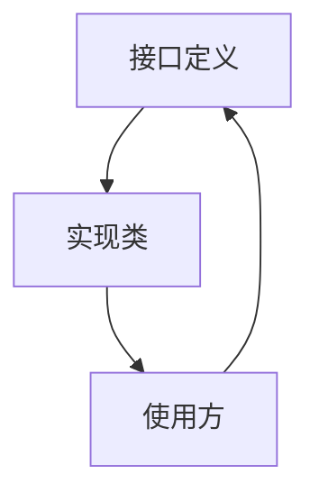
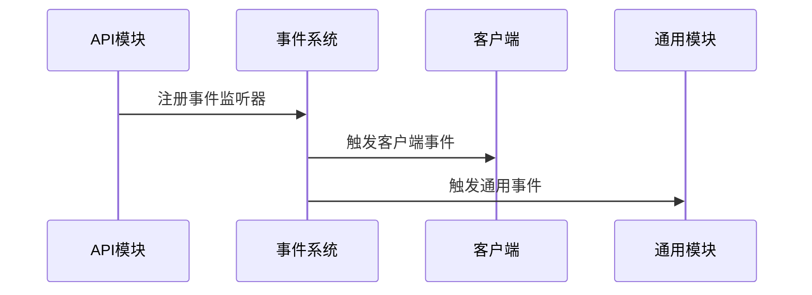

# API模块 - 详细文档

## 📍 导航面包屑
**[项目根] [^1]** / **[API模块] [^2]**

---

## 模块概述

**路径**：`src/main/java/committee/nova/mods/avaritia/api/`
**文件数量**：175个Java文件
**功能定位**：提供跨模块的通用接口、抽象类和工具方法

### 核心职责
- 定义客户端渲染系统的标准接口
- 提供游戏逻辑的抽象层
- 封装通用工具和辅助功能
- 建立模块间的通信协议

## 🔧 核心子模块

### 1. 客户端API (`client/`)
**文件数量**：~60个
**功能**：客户端渲染和交互相关的接口定义

#### 核心组件

**模型系统**：
- `ModelRegistryHelper.java` - 模型注册工具类
- `IVertexProducer.java` - 顶点生产者接口
- `IVertexConsumer.java` - 顶点消费者接口
- `PerspectiveModel.java` - 透视模型抽象
- `ItemQuadBakery.java` - 物品四边形烘焙

**渲染系统**：
- `CCModel.java` - 自定义模型系统
- `CCRenderState.java` - 渲染状态管理
- `CachedFormat.java` - 缓存格式管理
- `FluidItemRender.java` - 流体物品渲染

**光照系统**：
- `LightMatrix.java` - 光照矩阵计算
- `PlanarLightModel.java` - 平面光照模型
- `LC.java` - 光照常量定义

**缓冲区系统**：
- `AlphaOverrideVertexConsumer.java` - Alpha覆盖顶点消费者
- `BakedQuadVertexBuilder.java` - 烘焙四边形顶点构建器
- `DelegatingVertexConsumer.java` - 委托顶点消费者
- `ISpriteAwareVertexConsumer.java` - 精灵感知顶点消费者

#### 使用示例
```java
// 使用ModelRegistryHelper注册自定义模型
ModelRegistryHelper.registerCustomModel(customModel);

// 使用IVertexConsumer处理顶点数据
public class CustomRenderer implements IVertexConsumer {
    @Override
    public void vertex(float x, float y, float z, float red, float green, float blue, float alpha,
                      float texU, float texV, int light) {
        // 自定义顶点处理逻辑
    }
}
```

### 2. 通用API (`common/`)
**文件数量**：~40个
**功能**：提供游戏逻辑的通用接口和抽象

#### 核心组件

**物品系统**：
- `BaseItem.java` - 基础物品抽象类
- 物品属性和行为的标准化接口

**容器系统**：
- 容器接口定义
- 槽位管理抽象

**实体系统**：
- 生物行为接口
- 实体交互抽象

### 3. 接口定义 (`iface/`)
**文件数量**：~30个
**功能**：核心功能接口定义

#### 关键接口

**过滤器接口**：
- `IFilterItem.java` - 物品过滤器接口
- 定义物品过滤的标准方法

**交互接口**：
- 玩家交互抽象
- 物品使用接口

### 4. 初始化API (`init/`)
**文件数量**：~25个
**功能**：初始化和注册相关的接口

#### 核心功能

**注册接口**：
- 统一的游戏对象注册标准
- 延迟注册模式接口

**事件系统**：
- 初始化事件接口
- 生命周期钩子定义

### 5. 工具API (`util/`)
**文件数量**：~20个
**功能**：通用工具类和常量

#### 工具类别

**数学工具**：
- 向量计算工具
- 矩阵变换工具
- 几何计算辅助

**资源工具**：
- 纹理管理工具
- 音频处理工具

## 🏗️ 架构设计模式

### 1. 接口驱动设计


### 2. 事件驱动架构


### 3. 观察者模式
- 模型注册使用观察者模式
- 渲染状态变化通知机制
- 资源加载完成通知

## 🔌 与其他模块的交互

### 与客户端模块的关系
- **渲染接口**：提供渲染系统的标准接口
- **模型管理**：统一管理客户端模型注册
- **事件传递**：API作为事件的中转站

### 与通用模块的关系
- **抽象层**：为通用功能提供抽象接口
- **工具支持**：提供通用工具和辅助方法
- **标准定义**：建立游戏对象的标准

### 与核心模块的关系
- **数据接口**：定义核心数据的访问接口
- **管理协议**：建立数据管理的协议标准

## 📋 关键接口文档

### IVertexConsumer接口
**作用**：处理顶点数据的标准接口

```java
public interface IVertexConsumer {
    void vertex(float x, float y, float z, float red, float green, float blue, float alpha,
                float texU, float texV, int light);

    void endVertex();

    default void setNormal(float x, float y, float z) {}
}
```

### IFilterItem接口
**作用**：定义物品过滤功能

```java
public interface IFilterItem {
    boolean matches(ItemStack stack);

    boolean isBlacklistMode();

    Set<Item> getFilteredItems();
}
```

### ModelRegistryHelper类
**作用**：统一管理模型注册

```java
public class ModelRegistryHelper {
    public static void registerCustomModel(ResourceLocation id, IModelCustom model);

    public static void registerItemModel(Item item, ModelResourceLocation location);

    public static void registerBlockModel(Block block, ModelResourceLocation location);
}
```

## 🧪 测试覆盖

### 单元测试
- **模型测试**：验证模型注册功能
- **接口测试**：测试各接口的标准实现
- **工具测试**：验证工具类的正确性

### 集成测试
- **渲染测试**：测试渲染API的集成
- **事件测试**：验证事件传递机制
- **兼容性测试**：测试与其他模块的兼容性

## 🚀 性能优化

### 缓存机制
- **模型缓存**：ModelRegistryHelper使用缓存机制
- **纹理缓存**：减少重复加载
- **计算缓存**：缓存复杂的数学计算结果

### 异步处理
- **资源加载**：异步加载模型和纹理
- **计算优化**：将复杂计算移到后台线程
- **事件优化**：避免在主线程执行耗时操作

## 🔍 调试工具

### 日志记录
- **API日志**：详细的API调用日志
- **错误跟踪**：异常堆栈跟踪
- **性能监控**：关键操作的性能指标

### 开发工具
- **模型检查器**：实时查看模型状态
- **渲染调试**：调试渲染问题
- **事件监控**：监控事件传递

## 📈 扩展指南

### 新增接口
1. 定义接口规范
2. 提供默认实现（如需要）
3. 更新文档和使用示例
4. 添加相应的测试

### API版本管理
- **向后兼容**：确保新版本API兼容旧版本
- **废弃警告**：逐步废弃旧API
- **迁移指南**：提供迁移路径说明

## 🔗 相关资源

- **客户端模块**：[../client/CLAUDE.md](./../client/CLAUDE.md)
- **通用模块**：[../common/CLAUDE.md](./../common/CLAUDE.md)
- **项目根**：[../../CLAUDE.md](../../CLAUDE.md)

---

## 更新日志

- **v1.0** (2025-10-26)：初始API模块文档创建
  - 完整的接口定义文档
  - 使用示例和最佳实践
  - 与其他模块的交互说明

---

*注：本文档由AI自动生成，基于代码静态分析。如需最新信息，请查看源代码注释。*