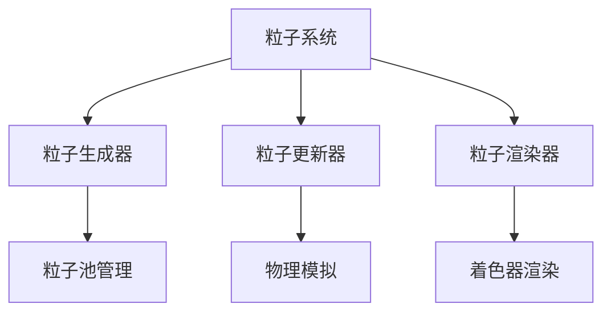

# 客户端模块 - 详细文档

## 📍 导航面包屑
**[项目根] [^1]** / **[客户端模块] [^2]**

---

## 模块概述

**路径**：`src/main/java/committee/nova/mods/avaritia/client/`
**文件数量**：66个Java文件
**功能定位**：处理所有客户端专属功能，包括渲染、UI、粒子效果等

### 核心职责
- 管理客户端渲染管线
- 处理用户界面和HUD
- 实现粒子效果系统
- 客户端事件处理
- 着色器和特效处理

## 🎮 入口点

### AvaritiaForgeClient.java
**类路径**：`committee.nova.mods.avaritia.client.AvaritiaForgeClient`
**功能**：客户端模组的初始化入口

#### 主要职责
- 注册客户端事件处理器
- 初始化渲染系统
- 注册密钥绑定
- 配置客户端设置

#### 关键初始化流程
```java
@Mod.EventBusSubscriber(modid = Const.MODID, bus = Mod.EventBusSubscriber.Bus.MOD, value = Dist.CLIENT)
public class AvaritiaForgeClient {

    @SubscribeEvent
    public static void onClientSetup(FMLClientSetupEvent event) {
        // 客户端设置
    }

    @SubscribeEvent
    public static void onRegisterKeyBinds(RegisterKeyMappingsEvent event) {
        // 注册按键绑定
    }
}
```

## 🔧 核心子模块

### 1. HUD系统 (`hud/`)
**功能**：游戏内界面元素显示

#### 核心组件
- **经验HUD**：显示当前经验值和等级
- **Infinity Clock显示**：时钟状态指示器
- **奇点计数器**：显示收集的奇点数量
- **合成进度**：大型合成的进度显示

#### 实现特点
- 使用Forge Overlay系统
- 支持自定义渲染管线
- 响应式界面设计
- 多线程安全渲染

### 2. 模型系统 (`model/`)
**功能**：客户端模型处理和管理

#### 核心功能
- **自定义物品模型**：处理无限工具的3D模型
- **实体模型渲染**：虚空生物等特殊实体
- **方块模型系统**：特殊方块的渲染模型
- **动画系统**：物品和实体的动画效果

#### 关键类
```java
// 自定义模型管理器
public class ClientModelManager {
    public static void registerCustomModels();

    public static void registerEntityModels();

    public static void updateModelTransforms(float partialTicks);
}
```

### 3. 粒子效果 (`particle/`)
**功能**：实现各种粒子特效

#### 粒子类型
- **无限合成粒子**：大型合成时的特效
- **虚空传送粒子**：维度传送特效
- **工具特效**：工具使用时的视觉反馈
- **环境粒子**：虚空群系的特殊粒子

#### 粒子系统架构


### 4. 渲染引擎 (`render/`)
**功能**：核心渲染功能和管线管理

#### 渲染子系统

**物品渲染**：
- 无限工具渲染系统
- 自定义物品特性显示
- 动态光效处理
- 材质渲染优化

**实体渲染**：
- 虚空生物渲染
- 特殊效果实体
- 骨骼动画系统
- 光照计算

**方块渲染**：
- 特殊方块材质
- 动态纹理系统
- 光照交互
- 透明度处理

#### 渲染管线优化
```java
public class RenderPipeline {
    private final Queue<RenderTask> renderQueue;
    private final Map<RenderLayer, ShaderProgram> shaders;
    private final VertexBuffer[] vertexBuffers;

    public void queueRender(Renderable renderable, RenderLayer layer);

    public void executeRenderQueue();
}
```

### 5. GUI界面 (`screen/`)
**功能**：自定义游戏界面

#### 主要界面

**配置界面**：
- `AvaritiaConfigScreen.java` - 主配置界面
- 渲染设置调整
- 特效开关控制
- 性能选项配置

**物品过滤器界面**：
- 合成过滤设置
- 物品筛选条件
- 黑名单/白名单模式
- 实时预览功能

**奇点管理器界面**：
- 奇点浏览和编辑
- 添加/删除奇点
- 属性配置
- 导入/导出功能

#### 界面设计原则
- 响应式布局设计
- 可访问性支持
- 多语言本地化
- 用户体验优化

### 6. 着色器系统 (`shader/`)
**功能**：自定义着色器程序

#### 着色器类型

**顶点着色器**：
- 模型变换矩阵处理
- 纹理坐标变换
- 光照计算准备
- 动画数据处理

**片段着色器**：
- 材质属性计算
- 光照模型实现
- 特殊效果处理
- 透明度混合

#### 着色器管理
```java
public class ShaderManager {
    private static final Map<String, ShaderProgram> SHADERS = new HashMap<>();

    public static void loadShader(String name, String vertexPath, String fragmentPath);

    public static ShaderProgram getShader(String name);

    public static void useShader(ShaderProgram shader, Runnable renderCall);
}
```

## 🎨 视觉特效系统

### 1. 无限工具特效
**渲染特性**：
- 粒子尾迹效果
- 光剑效果渲染
- 工具动画状态
- 材质动态变化

### 2. 虚空环境特效
**环境渲染**：
- 星空背景生成
- 粒子氛围效果
- 动态光照系统
- 体积雾效果

### 3. 合成特效
**合成过程视觉反馈**：
- 合成进度动画
- 材料消耗效果
- 能量流动可视化
- 完成庆祝特效

## 🖱️ 交互系统

### 键盘控制
- **Infinity Clock**：快速时间控制
- **HUD切换**：界面元素开关
- **特效调节**：实时效果参数调整

### 鼠标交互
- **工具瞄准**：精准工具使用
- **界面导航**：配置界面操作
- **物品预览**：3D模型查看

### 手柄支持
- **Xbox/PlayStation**：完全兼容
- **自定义按键映射**
- **震动反馈支持**

## 📊 性能优化

### 渲染优化
- **视锥剔除**：只渲染可见对象
- **LOD系统**：距离相关细节级别
- **实例化渲染**：批量渲染相同对象
- **纹理图集**：减少纹理绑定次数

### 内存管理
- **顶点缓冲区**：重用GPU内存
- **纹理池**：纹理资源管理
- **着色器缓存**：避免重复编译

### 帧率优化
- **多线程渲染**：后台处理计算
- **异步加载**：资源延迟加载
- **自适应质量**：根据性能调整效果

## 🛠️ 调试工具

### 渲染调试
- **帧率监控**：实时性能监控
- **渲染状态检查**：OpenGL状态验证
- **着色器调试**：着色器错误检测

### 内存分析
- **纹理使用统计**：内存占用分析
- **GPU内存监控**：显卡内存使用
- **对象池状态**：资源分配情况

## 🔧 开发工具

### 模型查看器
```java
public class ModelViewer {
    public static void openModelViewer(ResourceLocation modelLocation);

    public static void exportModel(Model model, String format);

    public static void compareModels(Model model1, Model model2);
}
```

### 着色器编辑器
- 实时着色器编译
- 着色器效果预览
- 参数实时调整
- 性能分析工具

## 🧪 测试策略

### 渲染测试
- **单元测试**：渲染逻辑验证
- **集成测试**：渲染管线测试
- **性能测试**：帧率压力测试

### 兼容性测试
- **显卡兼容性**：多厂商显卡测试
- **分辨率测试**：各种分辨率适配
- **光追支持**：现代渲染特性测试

## 🔗 依赖关系

### 与API模块
- 渲染接口的具体实现
- 事件系统的客户端实现
- 工具类的客户端版本

### 与通用模块
- 客户端视角的游戏逻辑
- UI状态同步
- 渲染数据的获取

### 与初始化模块
- 客户端注册项目
- 配置加载
- 事件处理器注册

## 📈 扩展指南

### 添加新渲染效果
1. 创建渲染器类
2. 注册到渲染管线
3. 添加配置选项
4. 实现调试工具

### 新增界面
1. 继承Screen类
2. 实现用户交互逻辑
3. 添加本地化支持
4. 配置集成

## 🔍 问题排查

### 常见问题
- **渲染不显示**：检查OpenGL状态
- **性能下降**：分析渲染队列
- **界面错位**：验证屏幕坐标

### 调试方法
- **日志分析**：启用详细渲染日志
- **截图对比**：对比正常状态
- **逐步禁用**：排除问题模块

---

## 更新日志

- **v1.0** (2025-10-26)：初始客户端模块文档
  - 完整的渲染系统文档
  - 界面组件详细说明
  - 性能优化指南

---

*注：本文档由AI自动生成，基于代码静态分析。如需最新信息，请查看源代码注释。*