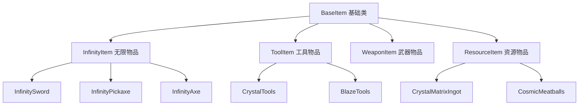
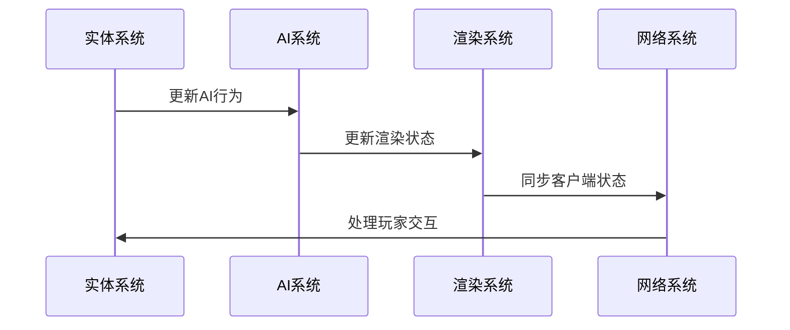
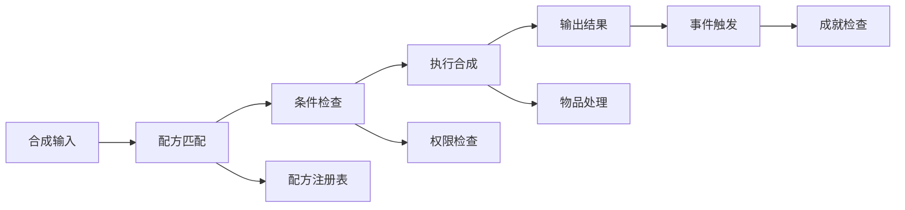

# 通用模块 - 详细文档

## 📍 导航面包屑
**[项目根] [^1]** / **[通用模块] [^2]**

---

## 模块概述

**路径**：`src/main/java/committee/nova/mods/avaritia/common/`
**文件数量**：135个Java文件
**功能定位**：包含游戏核心逻辑和内容定义，实现所有游戏机制

### 核心职责
- 定义游戏物品、方块和生物
- 实现游戏逻辑和机制
- 处理网络通信
- 管理合成配方和系统

## 🧩 核心子模块

### 1. 物品系统 (`item/`)
**文件数量**：~45个
**功能**：定义所有游戏物品

#### 物品分类

**无限工具系列** (`tools/infinity/`)：
- `InfinitySword.java` - 无限之剑
- `InfinityPickaxe.java` - 无限稿
- `InfinityAxe.java` - 无限斧
- `InfinityShovel.java` - 无限铲
- `InfinityHoe.java` - 无限锄

**武器系统** (`tools/`)：
- `VoidSword.java` - 虚空剑
- `ExtractionWand.java` - 提取法杖
- `CrystalMatrixSword.java` - 水晶矩阵剑

**特殊物品** (`misc/`)：
- `InfinityClock.java` - 无限时钟
- `EndestPearl.java` - 终极珍珠
- `SkullFireSword.java` - 骷髅烈焰剑

**奇点系统** (`singularity/`)：
- `SingularityItem.java` - 奇点物品
- `EternalSingularityItem.java` - 永恒奇点
- 各种资源奇点

**资源物品** (`resources/`)：
- `CrystalMatrixIngot.java` - 水晶锭
- `CosmicMeatballs.java` - 宇宙肉丸
- `NeutroniumCollector.java` - 中子收集器

#### 物品系统架构


### 2. 方块系统 (`block/`)
**文件数量**：~25个
**功能**：定义所有游戏方块

#### 方块类型

**特殊功能方块**：
- `CompressionCrateBlock.java` - 压缩板条箱
- `InfinityBlock.java` - 无限方块
- `CrystalMatrixBlock.java` - 水晶矩阵方块
- `NeutroniumBlock.java` - 中子方块

**机器方块**：
- `CompressorBlock.java` - 压缩器
- `CollectorBlock.java` - 收集器
- `ExtremeCraftingTableBlock.java` - 极限工作台

**装饰方块**：
- `HooverBlock.java` - 胡佛方块
- `RainbowGeneratorBlock.java` - 彩虹生成器

#### 方块特性系统
```java
public abstract class AvaritiaBlock extends Block {
    protected AvaritiaBlock(Properties properties) {
        super(properties);
        // 实现Avaritia特有功能
    }

    public abstract void onBlockHarvested(World world, PlayerEntity player, BlockPos pos, BlockState state);

    // 方块破坏效果
    public abstract void onPlayerDestroy(PlayerEntity playerIn, World worldIn, BlockPos pos, BlockState state);
}
```

### 3. 生物系统 (`entity/`)
**文件数量**：~15个
**功能**：定义特殊生物和实体

#### 实体类型

**特殊生物**：
- `GapingVoidEntity.java` - 张嘴虚空生物
- `VoidEntity.java` - 虚空实体
- `EndestPearlEntity.java` - 终极珍珠实体

**生物特征**：
- 特殊AI行为
- 虚空环境适应
- 远程攻击能力
- 环境交互机制

#### 实体系统架构


### 4. 方块实体系统 (`tile/`)
**文件数量**：~20个
**功能**：实现方块的特殊功能和状态管理

#### 方块实体类型

**机器方块实体**：
- `CompressorTileEntity.java` - 压缩器方块实体
- `CollectorTileEntity.java` - 收集器方块实体
- `ExtremeCraftingTableTileEntity.java` - 极限工作台方块实体

**存储方块实体**：
- `InfinityChestTileEntity.java` - 无限箱子方块实体
- `CompressionCrateTileEntity.java` - 压缩板条箱方块实体

#### 方块实体管理器
```java
public abstract class AvaritiaTileEntity extends TileEntity {
    protected AvaritiaTileEntity(TileEntityType<?> type) {
        super(type);
        this.dataManager = new SimpleDataManager();
    }

    public abstract void tick();

    public abstract CompoundNBT write(CompoundNBT compound);

    public abstract void read(CompoundNBT compound);

    protected SimpleDataManager dataManager;
}
```

### 5. 容器系统 (`container/`)
**文件数量**：~10个
**功能**：实现物品容器和GUI逻辑

#### 容器类型

**机器容器**：
- `CompressorContainer.java` - 压缩器容器
- `CollectorContainer.java` - 收集器容器
- `ExtremeCraftingContainer.java` - 极限合成容器

**存储容器**：
- `InfinityChestContainer.java` - 无限箱子容器
- `CompressionCrateContainer.java` - 压缩板条箱容器

### 6. 合成系统 (`crafting/`)
**文件数量**：~15个
**功能**：处理游戏合成机制

#### 合成类型

**大型合成**：
- `ExtremeShapedRecipe.java` - 极限有形合成
- `ExtremeShapelessRecipe.java` - 极限无形合成
- `EternalSingularityCraftRecipe.java` - 永恒奇点合成

**机器合成**：
- `CompressorRecipe.java` - 压缩器合成
- `CollectorRecipe.java` - 收集器合成

#### 合成系统架构


### 7. 网络通信 (`net/`)
**文件数量**：~5个
**功能**：处理客户端-服务端网络通信

#### 网络包类型

**数据同步**：
- `PacketSyncData.java` - 数据同步包
- `PacketUpdateTile.java` - 方块实体更新
- `PacketSpawnParticle.java` - 粒子生成同步

**玩家操作**：
- `PacketUseItem.java` - 物品使用
- `PacketCraftingAction.java` - 合成操作

### 8. 包装器系统 (`wrappers/`)
**文件数量**：~5个
**功能**：为外部系统提供包装器接口

#### 包装器类型

**兼容性包装器**：
- `CraftTweakerWrapper.java` - CraftTweaker集成
- `KubeJSWrapper.java` - KubeJS集成
- `JEIWrapper.java` - JEI配方查看集成

## 🎮 核心游戏机制

### 1. 无限工具系统
**功能特性**：
- 超高耐久度（无限耐久）
- 极端挖掘速度
- 特殊能力（如传送、自动挖掘）
- 视觉特效支持

**技术实现**：
```java
public class InfinitySword extends SwordItem {
    @Override
    public boolean isDamageable() {
        return false; // 无限耐久
    }

    @Override
    public float getAttackDamage() {
        return 9999.0f; // 高伤害
    }

    @Override
    public boolean onEntitySwing(ItemStack stack, LivingEntity entity) {
        // 特殊技能实现
        return super.onEntitySwing(stack, entity);
    }
}
```

### 2. 奇点系统
**核心概念**：
- 通过合成获得各种奇点
- 用于制作终极物品
- 可自定义奇点（通过JSON）
- 具有特殊属性和能力

**数据管理**：
```java
public class Singularity {
    private ResourceLocation id;
    private Component displayName;
    private ItemStack itemStack;
    private List<Effect> effects;
    private Map<String, Integer> attributes;
}
```

### 3. 虚空维度
**环境特性**：
- 独特的生物群系
- 特殊光照系统
- 虚空生物生成
- 传送机制

### 4. 大型合成系统
**合成特点**：
- 9x9工作台
- 大型配方支持
- 特殊材料要求
- 合成时间机制

## 🔧 系统集成

### 与初始化模块的关系
- 物品注册通过`ModItems`类
- 方块注册通过`ModBlocks`类
- 生物注册通过`ModEntities`类
- 配方注册通过`ModRecipeTypes`类

### 与API模块的关系
- 实现API定义的接口
- 提供工具类给其他模块使用
- 遵循API制定的规范

### 与核心模块的关系
- 提供数据给核心模块管理
- 使用核心模块的工具功能
- 响应核心模块的事件

## 📊 性能优化

### 数据缓存
- **配方缓存**：缓存常用配方
- **方块状态缓存**：减少状态查询
- **实体数据缓存**：优化实体访问

### 批处理
- **实体更新批处理**：合并更新操作
- **方块更新批处理**：减少更新频率
- **物品生成批处理**：批量生成物品

### 懒加载
- **资源懒加载**：按需加载资源
- **数据懒加载**：延迟加载大数据
- **功能懒加载**：按需启用功能

## 🧪 测试策略

### 功能测试
- **物品功能测试**：验证物品行为
- **方块交互测试**：测试方块功能
- **生物AI测试**：验证生物行为
- **合成测试**：验证合成机制

### 集成测试
- **系统集成测试**：测试模块间协作
- **性能测试**：压力测试
- **兼容性测试**：与其他模组兼容

### 自动化测试
- **单元测试**：JUnit 5框架
- **集成测试**：TestNG或JUnit
- **性能测试**：JMH基准测试

## 🔍 问题排查

### 调试工具
- **游戏日志分析**：详细日志记录
- **性能监控**：实时性能数据
- **状态检查**：系统状态验证

### 常见问题
- **合成失败**：检查配方和材料
- **物品损坏**：检查物品状态
- **性能问题**：分析系统瓶颈

## 🚀 扩展指南

### 添加新物品
1. 继承合适的基类
2. 实现特殊功能
3. 注册到物品注册表
4. 添加本地化文本
5. 编写测试用例

### 添加新方块
1. 继承AvaritiaBlock
2. 实现方块逻辑
3. 注册方块和方块实体
4. 添加方块状态
5. 配置材质和音效

### 添加新生物
1. 继承对应的生物类
2. 实现AI行为
3. 注册生物和刷怪蛋
4. 配置生成规则
5. 实现渲染支持

## 📈 平衡性设计

### 物品平衡
- **获取难度**：通过合成链控制
- **使用成本**：平衡消耗和收益
- **游戏影响**：控制对游戏平衡的影响

### 合成设计
- **材料要求**：使用稀有材料
- **合成时间**：增加制作难度
- **替代方案**：提供多种路径

---

## 更新日志

- **v1.0** (2025-10-26)：初始通用模块文档
  - 完整的功能模块说明
  - 游戏机制详细解释
  - 开发扩展指南

---

*注：本文档由AI自动生成，基于代码静态分析。如需最新信息，请查看源代码注释。*