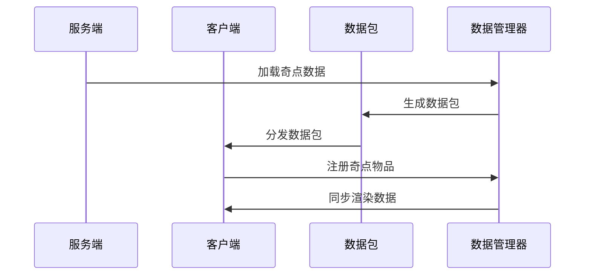
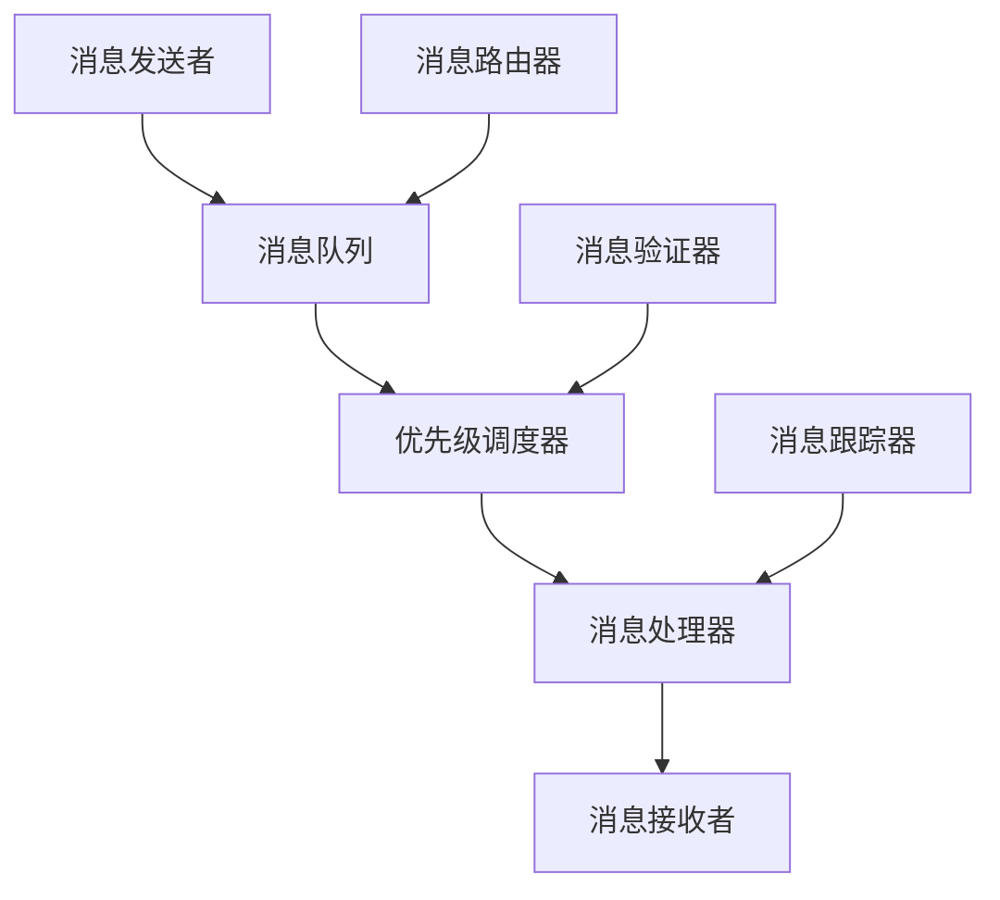
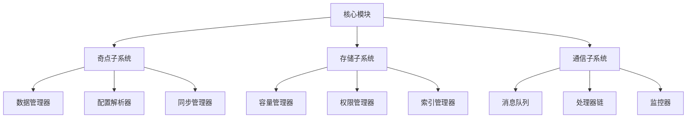
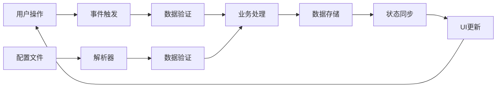

# 核心模块 - 详细文档

## 📍 导航面包屑
**[项目根] [^1]** / **[核心模块] [^2]**

---

## 模块概述

**路径**：`src/main/java/committee/nova/mods/avaritia/core/`
**文件数量**：20个Java文件
**功能定位**：项目的核心业务逻辑和数据管理系统

### 核心职责
- 管理项目核心数据和状态
- 处理关键业务逻辑
- 提供系统级服务
- 维护数据一致性

## 🎯 核心子模块

### 1. 奇点数据管理 (`singularity/`)
**文件数量**：~12个
**功能**：管理和维护奇点系统数据

#### 核心组件

**SingularityDataManager.java**：
- **功能**：奇点数据的中央管理器
- **特点**：使用标准Minecraft数据包系统
- **优势**：支持动态重载、条件加载、网络同步
- **架构**：基于观察者模式的数据管理

```java
/**
 * 奇点数据管理器 - 新的数据包系统
 * <p>
 * 使用标准的Minecraft数据包系统替代旧的配置文件方式
 * 支持动态重载、条件加载、网络同步等功能
 */
public class SingularityDataManager {
    private static final Logger LOGGER = Const.LOGGER;
    private static SingularityDataManager INSTANCE;

    @Getter @Setter
    private Map<ResourceLocation, Singularity> cachedSingularities = new LinkedHashMap<>();
}
```

#### 奇点数据结构
```java
public class Singularity {
    private ResourceLocation id;
    private Component displayName;
    private ItemStack representation;
    private List<Effect> effects;
    private Map<String, Integer> attributes;
    private UnaryOperator<ItemStack> transformFunction;
    private ResourceLocation texture;
}
```

#### 数据同步机制


#### 关键特性
- **JSON配置支持**：通过JSON文件定义自定义奇点
- **热重载能力**：无需重启服务器即可重新加载
- **权限控制**：支持基于权限的奇点管理
- **版本兼容**：向前兼容的数据格式设计

### 2. 无限箱子系统 (`chest/`)
**文件数量**：~5个
**功能**：实现无限容量的存储系统

#### 系统架构
- **InfinityChestTileEntity.java**：无限箱子方块实体
- **InfinityChestContainer.java**：无限箱子容器
- **CapacityManager.java**：容量管理器

#### 技术特点
- **虚拟存储**：不消耗实际世界存储空间
- **索引系统**：高效的物品索引和检索
- **权限控制**：玩家级别的存储隔离
- **压缩存储**：智能的物品压缩算法

#### 容量管理
```java
public class CapacityManager {
    private static final Map<UUID, StorageSpace> playerSpaces = new ConcurrentHashMap<>();

    public static StorageSpace getPlayerSpace(UUID playerId) {
        return playerSpaces.computeIfAbsent(playerId, k -> new StorageSpace());
    }

    public static boolean storeItem(UUID playerId, ItemStack stack) {
        StorageSpace space = getPlayerSpace(playerId);
        return space.addItem(stack);
    }
}
```

### 3. 通信管道系统 (`channel/`)
**文件数量**：~3个
**功能**：提供模块间的高效通信机制

#### 通信特性
- **异步消息处理**：非阻塞的消息传递
- **消息队列**：可靠的消息传递保证
- **优先级系统**：重要消息优先处理
- **调试支持**：完整的消息跟踪和日志

#### 管道架构


## 🔧 核心服务

### 1. 数据服务
**功能**：提供统一的数据访问接口
- 奇点数据访问
- 存储空间管理
- 配置数据访问
- 临时数据缓存

### 2. 事件服务
**功能**：处理系统级事件
- 数据变更事件
- 玩家交互事件
- 系统启动/关闭事件
- 错误和异常事件

### 3. 资源服务
**功能**：管理核心资源
- 纹理资源管理
- 音频资源管理
- 模型资源管理
- 配置资源管理

## 🏗️ 系统架构

### 模块化设计


### 数据流架构


## 🔄 生命周期管理

### 初始化流程
1. **系统启动**：加载基础配置
2. **数据加载**：初始化数据管理器
3. **服务注册**：注册核心服务
4. **事件绑定**：绑定事件处理器
5. **状态同步**：建立同步机制

### 关闭流程
1. **数据保存**：保存所有未保存数据
2. **连接断开**：断开所有外部连接
3. **资源释放**：释放占用的资源
4. **状态清理**：清理系统状态

## 📊 性能优化

### 内存管理
- **对象池**：重用昂贵对象
- **弱引用**：避免内存泄漏
- **缓存策略**：智能缓存常用数据
- **垃圾回收**：优化GC行为

### 计算优化
- **批量处理**：合并小操作
- **异步处理**：后台计算
- **预计算**：缓存计算结果
- **算法优化**：选择高效算法

### 存储优化
- **压缩存储**：减少存储占用
- **分片存储**：分布式存储
- **索引优化**：快速数据检索
- **备份策略**：数据安全保障

## 🔐 安全机制

### 权限控制
- **玩家权限**：基于UUID的权限检查
- **操作权限**：关键操作的权限验证
- **数据权限**：数据访问权限控制

### 数据验证
- **输入验证**：验证所有外部输入
- **类型检查**：确保数据类型正确
- **范围检查**：验证数值范围
- **完整性检查**：验证数据完整性

### 错误处理
- **异常捕获**：全面异常捕获机制
- **错误恢复**：自动错误恢复
- **降级策略**：失败时的备选方案
- **错误报告**：详细的错误报告

## 🧪 测试策略

### 单元测试
- **数据管理器测试**：验证数据操作
- **存储系统测试**：验证存储功能
- **通信系统测试**：验证消息传递

### 集成测试
- **跨模块测试**：测试模块间协作
- **性能测试**：压力测试
- **并发测试**：多线程安全性测试

### 自动化测试
- **回归测试**：防止功能回退
- **持续集成**：自动化测试流程
- **性能基准**：性能回归检测

## 📈 监控和分析

### 系统监控
- **性能指标**：CPU、内存使用监控
- **操作统计**：关键操作统计
- **错误监控**：错误发生频率
- **响应时间**：操作响应时间

### 数据分析
- **使用模式分析**：用户行为分析
- **性能瓶颈分析**：找出性能瓶颈
- **错误模式分析**：识别常见错误
- **容量规划**：预测资源需求

## 🔍 故障排除

### 常见问题
- **数据丢失**：检查数据备份和恢复
- **性能下降**：分析性能瓶颈
- **内存泄漏**：检查对象生命周期
- **并发问题**：检查线程安全

### 调试工具
- **日志分析**：详细的系统日志
- **性能分析器**：性能问题诊断
- **内存分析器**：内存使用分析
- **网络分析器**：通信问题诊断

### 恢复策略
- **自动恢复**：系统自动恢复机制
- **手动恢复**：管理员手动恢复
- **数据备份**：定期数据备份
- **灾难恢复**：完整的恢复方案

## 🚀 扩展指南

### 添加新数据服务
1. 定义数据结构
2. 实现数据管理器
3. 添加同步机制
4. 实现权限控制
5. 添加测试用例

### 添加新通信机制
1. 定义消息格式
2. 实现消息处理器
3. 添加路由机制
4. 实现监控功能
5. 进行性能测试

## 📋 API接口

### 奇点数据API
```java
public interface ISingularityAPI {
    List<Singularity> getAllSingularities();

    Optional<Singularity> getSingularity(ResourceLocation id);

    boolean addCustomSingularity(Singularity singularity);

    void reloadSingularities();
}
```

### 存储系统API
```java
public interface IStorageAPI {
    StorageSpace getPlayerStorage(UUID playerId);

    boolean storeItem(UUID playerId, ItemStack item);

    Optional<ItemStack> retrieveItem(UUID playerId, int slot);

    int getStorageSize(UUID playerId);
}
```

---

## 更新日志

- **v1.0** (2025-10-26)：初始核心模块文档
  - 完整的数据管理说明
  - 系统架构设计文档
  - 性能优化指南

---

*注：本文档由AI自动生成，基于代码静态分析。如需最新信息，请查看源代码注释。*