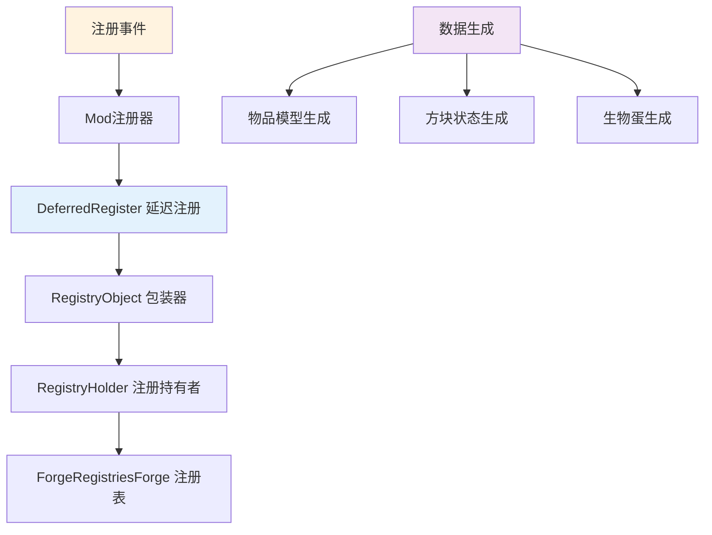
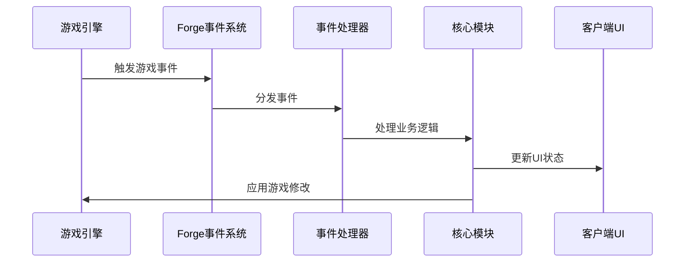
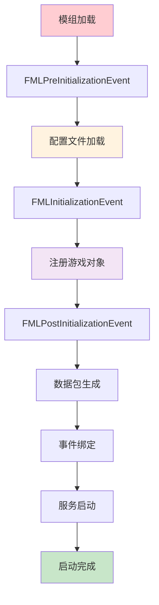

# 初始化模块 - 详细文档

## 📍 导航面包屑
**[项目根] [^1]** / **[初始化模块] [^2]**

---

## 模块概述

**路径**：`src/main/java/committee/nova/mods/avaritia/init/`
**文件数量**：109个Java文件
**功能定位**：项目初始化、注册和配置管理

### 核心职责
- 统一管理所有游戏对象注册
- 处理模组生命周期事件
- 管理系统配置和设置
- 提供数据生成和工具支持

## 🎯 核心子模块

### 1. 注册系统 (`registry/`)
**文件数量**：~25个
**功能**：统一管理所有游戏对象的注册

#### 核心注册类

**ModItems.java** - 物品注册中心
- **注册物品数量**：175+ 种物品
- **功能特性**：
  - 统一注册机制
  - 延迟注册模式
  - 自动命名生成
  - 国际化支持

```java
public class ModItems {
    private static final DeferredRegister<Item> ITEMS = DeferredRegister.create(ForgeRegistries.ITEMS, Const.MODID);

    // 无限工具系列
    public static final RegistryObject<Item> INFINITY_SWORD = register("infinity_sword",
            () -> new InfinitySwordItem(Tiers.DIAMOND, 8, -3.4f, new Item.Properties()));

    public static final RegistryObject<Item> INFINITY_PICKAXE = register("infinity_pickaxe",
            () -> new InfinityPickaxeItem(Tiers.DIAMOND, 1, -3.0f, new Item.Properties()));

    // 特殊物品
    public static final RegistryObject<Item> INFINITY_CLOCK = register("infinity_clock",
            () -> new InfinityClockItem(new Item.Properties()));

    public static final RegistryObject<Item> ENDEST_PEARL = register("endest_pearl",
            () -> new EndestPearlItem(new Item.Properties()));
}
```

**ModBlocks.java** - 方块注册中心
- **注册方块数量**：50+ 种方块
- **功能特性**：
  - 方块状态管理
  - 方块实体注册
  - 方块物品注册
  - 破坏效果定制

**ModEntities.java** - 生物注册中心
- **注册生物数量**：5+ 种生物
- **功能特性**：
  - 生物AI注册
  - 刷怪规则配置
  - 生物渲染注册
  - 网络同步设置

#### 注册管理器架构


#### 注册工具类
```java
public class RegistryHelper {
    /**
     * 注册物品的工具方法
     */
    public static <T extends Item> RegistryObject<T> registerItem(String name, Supplier<T> supplier) {
        return ModItems.ITEMS.register(name, supplier);
    }

    /**
     * 注册方块的工具方法
     */
    public static <T extends Block> RegistryObject<T> registerBlock(String name, Supplier<T> supplier) {
        return ModBlocks.BLOCKS.register(name, supplier);
    }

    /**
     * 注册生物的工具方法
     */
    public static <T extends Entity> RegistryObject<EntityType<T>> registerEntity(String name, EntityType.EntityFactory<T> factory) {
        return ModEntities.ENTITIES.register(name, () -> EntityType.Builder.of(factory, MobCategory.MISC));
    }
}
```

### 2. 配置管理 (`config/`)
**文件数量**：~3个
**功能**：管理系统配置和设置

#### 配置文件结构
```toml
# Avaritia模组配置文件
# 版本: 1.3.9.3-beta1

[general]
# 通用设置
enableVoidDimension = true
enableParticleEffects = true
enableSoundEffects = true

[tools]
# 工具设置
infinityToolSpeed = 100.0
infinityToolDamage = 1000.0
infinityToolDurability = -1

[compressor]
# 压缩器设置
compressorSpeed = 1.0
compressorEnergyCost = 1000

[recipes]
# 配方设置
extremeRecipeEnabled = true
recipeCostMultiplier = 1.0
```

#### 配置加载系统
```java
public class ModConfig {
    public static final String CONFIG_FILE = "avaritia.toml";

    private static ForgeConfigSpec.Builder BUILDER = new ForgeConfigSpec.Builder();
    private static ForgeConfigSpec.Builder SERVER_BUILDER = new ForgeConfigSpec.Builder();

    // 通用配置
    public static final ForgeConfigSpec.ConfigValue<Boolean> ENABLE_VOID_DIMENSION;
    public static final ForgeConfigSpec.ConfigValue<Boolean> ENABLE_PARTICLE_EFFECTS;

    // 工具配置
    public static final ForgeConfigSpec.ConfigValue<Double> INFINITY_TOOL_SPEED;
    public static final ForgeConfigSpec.ConfigValue<Integer> INFINITY_TOOL_DAMAGE;

    public static final ForgeConfigSpec SPEC;

    static {
        // 配置项定义
        SERVER_BUILDER.comment("通用设置")
                .define("enableVoidDimension", true);
        SERVER_BUILDER.comment("工具设置")
                .define("infinityToolSpeed", 100.0);

        SPEC = SERVER_BUILDER.build();
    }
}
```

### 3. 数据生成 (`data/`)
**文件数量**：~8个
**功能**：生成数据包和资源文件

#### 数据生成器架构
```java
public class ModDataGen {
    public static class Providers {
        public static void gather(GatherDataEvent event) {
            DataGenerator generator = event.getGenerator();
            ExistingFileHelper existingFileHelper = event.getExistingFileHelper();

            // 物品模型生成
            generator.addProvider(event.includeClient(), new ModItemModelProvider(generator, existingFileHelper));

            // 方块状态生成
            generator.addProvider(event.includeClient(), new ModBlockStateProvider(generator, existingFileHelper));

            // 战利品表生成
            generator.addProvider(event.includeServer(), new ModLootTableProvider(generator));

            // 配方生成
            generator.addProvider(event.includeServer(), new ModRecipeProvider(generator));

            // 标签生成
            generator.addProvider(event.includeServer(), new ModTagProvider(generator, existingFileHelper));
        }
    }
}
```

#### 生成数据类型
- **物品模型**：JSON格式的物品3D模型定义
- **方块状态**：方块状态JSON文件
- **战利品表**：生物掉落和方块破坏战利品表
- **合成配方**：所有合成配方的JSON定义
- **标签系统**：物品、方块、生物标签定义

### 4. 事件处理器 (`handler/`)
**文件数量**：~20个
**功能**：处理各种游戏事件

#### 事件类型

**生命周期事件**：
- `ModLifecycleHandler.java` - 处理模组启动和关闭
- `ServerLifecycleHandler.java` - 处理服务器生命周期

**玩家事件**：
- `PlayerEventHandler.java` - 处理玩家相关事件
- `PlayerLoginHandler.java` - 处理玩家登录
- `PlayerLogoutHandler.java` - 处理玩家登出

**游戏事件**：
- `BlockEventHandler.java` - 处理方块相关事件
- `EntityEventHandler.java` - 处理生物相关事件
- `ItemEventHandler.java` - 处理物品相关事件

#### 事件系统架构


### 5. Mixin注入 (`mixins/`)
**文件数量**：~15个
**功能**：通过Mixin进行字节码注入

#### Mixin使用场景

**游戏逻辑修改**：
- 修改游戏合成表检查逻辑
- 添加新的生物生成规则
- 修改物品使用逻辑

**性能优化**：
- 优化渲染管线
- 改进碰撞检测
- 减少内存分配

**兼容性补丁**：
- 修复与其他模组的冲突
- 添加缺失的功能
- 统一API接口

#### Mixin配置
```java
@Mixin(ShapedRecipe.class)
public abstract class ShapedRecipeMixin {
    @Inject(method = "assemble", at = @At("HEAD"), cancellable = true)
    public void onAssemble(CraftingContainer craftingContainer, CallbackItemStackWrapper returnItemStack) {
        // 自定义合成逻辑
        if (AvaritiaConfig.ENABLE_EXTREME_RECIPES.get()) {
            // 处理Avaritia特殊配方
        }
    }
}
```

### 6. 测试系统 (`test/`)
**文件数量**：~10个
**功能**：提供测试工具和框架

#### 测试类型

**单元测试**：
- 注册器测试
- 配置系统测试
- 工具类测试

**集成测试**：
- 模块集成测试
- 游戏功能测试
- 性能测试

**自动化测试**：
- 持续集成测试
- 回归测试
- 压力测试

## 🔧 初始化流程

### 模组启动序列


### 注册时序
1. **延迟注册器创建**：创建DeferredRegister实例
2. **注册对象定义**：定义RegistryObject
3. **Forge注册表填充**：在相应阶段填充到Forge注册表
4. **后处理**：执行注册后的处理逻辑

## 📋 重要枚举和常量

### 资源类型枚举
```java
public enum ModResourceBlocks {
    CRYSTAL_MATRIX_BLOCK("crystal_matrix_block"),
    NEUTRONIUM_BLOCK("neutronium_block"),
    INFINITY_BLOCK("infinity_block");

    private final String name;

    ModResourceBlocks(String name) {
        this.name = name;
    }
}
```

### 工具等级枚举
```java
public enum ModToolTiers {
    INFINITY(10000, 5000, 30, 12, 5, Materials.INFINITY),
    CRYSTAL(2500, 1500, 10, 8, 3, Materials.CRYSTAL_MATRIX);

    private final int maxUses, harvestLevel, efficiency, damage, enchantability;
    private final Ingredient repairMaterial;
}
```

## 🛠️ 开发工具

### 注册工具
```java
public class RegistrationTools {
    /**
     * 自动注册所有物品
     */
    public static void registerAllItems() {
        // 自动扫描并注册物品
    }

    /**
     * 自动注册所有方块
     */
    public static void registerAllBlocks() {
        // 自动扫描并注册方块
    }

    /**
     * 生成数据文件
     */
    public static void generateDataFiles() {
        // 自动生成数据文件
    }
}
```

### 配置工具
```java
public class ConfigurationTools {
    /**
     * 重新加载配置
     */
    public static void reloadConfiguration() {
        // 重新加载配置文件
    }

    /**
     * 验证配置
     */
    public static boolean validateConfiguration() {
        // 验证配置项的有效性
        return true;
    }
}
```

## 🔍 调试支持

### 调试命令
- `/avaritia debug` - 开启调试模式
- `/avaritia reload` - 重新加载配置
- `/avaritia register` - 查看注册状态
- `/avaritia performance` - 性能统计

### 日志系统
```java
public class ModLogger {
    private static final Logger LOGGER = LogManager.getLogger(Const.MODID);

    public static void info(String message, Object... args) {
        LOGGER.info(String.format(message, args));
    }

    public static void warn(String message, Object... args) {
        LOGGER.warn(String.format(message, args));
    }

    public static void error(String message, Object... args) {
        LOGGER.error(String.format(message, args));
    }
}
```

## 📊 性能监控

### 启动性能
- 注册耗时统计
- 配置加载时间
- 数据生成时间
- 事件绑定时间

### 内存使用
- 注册表内存占用
- 配置数据内存使用
- 事件监听器内存使用

## 🚀 扩展指南

### 添加新注册器
1. 创建DeferredRegister实例
2. 定义RegistryObject变量
3. 实现注册方法
4. 添加数据生成支持
5. 更新测试用例

### 添加新配置项
1. 在配置构建器中定义
2. 添加配置类字段
3. 实现配置访问方法
4. 添加配置验证
5. 更新配置文档

### 添加新事件处理器
1. 创建事件处理类
2. 实现@SubscribeEvent方法
3. 注册事件监听器
4. 添加事件测试
5. 更新事件文档

---

## 更新日志

- **v1.0** (2025-10-26)：初始初始化模块文档
  - 完整的注册系统说明
  - 配置管理详细指南
  - 数据生成系统文档

---

*注：本文档由AI自动生成，基于代码静态分析。如需最新信息，请查看源代码注释。*